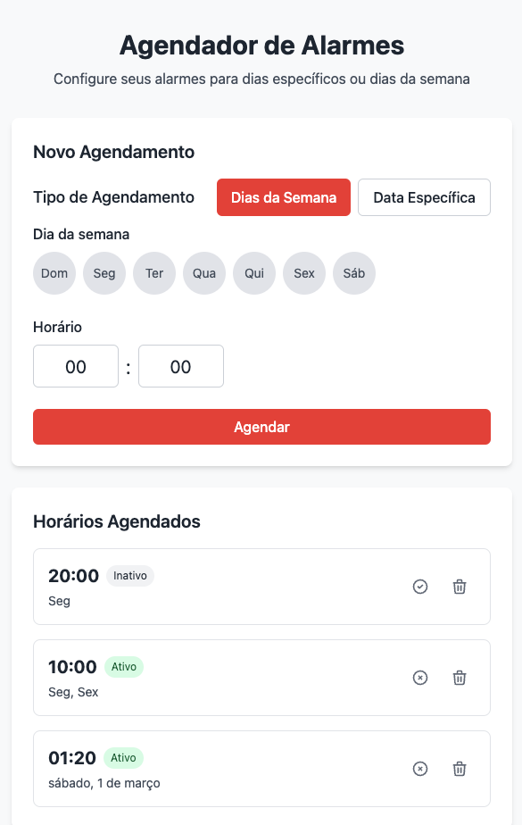

# Agendador de Alarmes

Uma aplicação Angular moderna que permite aos usuários configurar e gerenciar alarmes de forma intuitiva, seja por dias da semana específicos ou por datas.



## 📋 Recursos

- Criação de alarmes personalizados
- Configuração por dias específicos da semana (Domingo a Sábado)
- Configuração por datas específicas
- Interface de usuário intuitiva e responsiva
- Visualização clara dos alarmes agendados

## ⚠️ Importante

**Nota**: Esta aplicação é apenas um agendador visual de alarmes. Ela **não possui**:
- Funcionalidade de despertador/notificação quando o horário é atingido
- Conexão com backend
- Persistência de dados além da sessão atual

Esta é uma aplicação frontend pura, criada como base para implementações mais completas. Você está livre para expandir suas funcionalidades conforme necessário.

## 🚀 Tecnologias

Este projeto foi desenvolvido com:

- **Angular 18.1.0**: Framework front-end para criação de interfaces de usuário
- **TailwindCSS 3.3.5**: Framework CSS para estilização rápida e responsiva
- **RxJS 7.8.1**: Biblioteca para programação reativa
- **date-fns 3.0.0**: Biblioteca para manipulação de datas

## 🛠️ Instalação

```bash
# Clone o repositório
git clone https://github.com/seu-usuario/agendamentos-alarmes.git

# Entre no diretório
cd agendamentos-alarmes

# Instale as dependências
npm install

# Inicie o servidor de desenvolvimento
npm start
```

Acesse `http://localhost:4200/` no seu navegador para ver a aplicação.

## 📱 Uso

1. **Criar um novo alarme**:
   - Selecione "Dias da Semana" ou "Data Específica"
   - Para dias da semana, clique nos dias desejados (Dom, Seg, Ter, Qua, Qui, Sex, Sáb)
   - Defina o horário através dos seletores (horas e minutos)
   - Clique em "Agendar" para salvar

2. **Visualizar alarmes**:
   - Todos os alarmes configurados são exibidos na seção "Horários Agendados"
   - Quando não há alarmes, é exibida a mensagem: "Nenhum horário agendado ainda"

## 🧩 Estrutura do Projeto

```
.
├── angular.json
├── package.json
├── package-lock.json
├── postcss.config.js
├── README.md
├── tailwind.config.js
├── tsconfig.app.json
├── tsconfig.json
├── .env
├── .gitignore
├── node_modules/
└── src/
    ├── app/
    │   ├── components/
    │   │   ├── alarm-form.component.ts
    │   │   └── alarm-list.component.ts
    │   ├── models/
    │   │   └── alarm.model.ts
    │   ├── services/
    │   │   └── alarm.service.ts
    │   └── global_styles.css
    ├── index.html
    └── main.ts
```

## 🔄 Componentes Principais

1. **alarm-form.component.ts**: 
   - Formulário para criação e edição de alarmes
   - Contém seletores de dias da semana e definição de horário
   - Gerencia a alternância entre modos de agendamento (dias da semana/data específica)

2. **alarm-list.component.ts**: 
   - Exibe os alarmes agendados
   - Mostra a mensagem de "Nenhum horário agendado ainda" quando não há alarmes
   - Potencialmente gerencia a exclusão e edição de alarmes existentes

3. **alarm.model.ts**: 
   - Define a estrutura de dados para os alarmes
   - Contém propriedades como dias selecionados, horário, tipo de agendamento, etc.

4. **alarm.service.ts**: 
   - Gerencia a lógica de negócios relacionada aos alarmes
   - Manipula a criação, leitura, atualização e exclusão de alarmes
   - Gerencia apenas os dados em memória durante a sessão atual

## 💡 Possíveis Implementações

Esta aplicação é de código aberto e livre para uso e modificação. Aqui estão algumas sugestões para expandir suas funcionalidades:

- Implementar notificações push quando o horário do alarme for atingido
- Adicionar sons personalizados para alarmes
- Conectar a um backend para persistência de dados
- Adicionar persistência local (localStorage/IndexedDB)
- Implementar funcionalidades de edição e exclusão de alarmes
- Integrar com calendários externos ou APIs de notificação
- Adicionar configurações de repetição e padrões de alarme

## 📄 Licença

Este projeto está livre para uso e modificação por qualquer pessoa ou organização para qualquer finalidade. Não há restrições quanto ao uso, cópia, modificação, fusão, publicação, distribuição, sublicenciamento e/ou venda de cópias.

---

*Este projeto foi gerado com bolt.new usando StackBlitz.*
